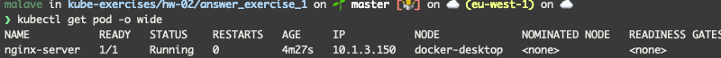

- ¿Cómo puedo obtener las últimas 10 líneas de la salida estándar (logs generados por la aplicación)?
```shell script
 kubectl logs --tail=10 nginx-server
```
- ¿Cómo podría obtener la IP interna del pod? Aporta capturas para indicar el proceso que seguirías.

```shell script
kubectl get pod -o wide
```


- ¿Qué comando utilizarías para entrar dentro del pod?
```shell script
kubectl exec --stdin --tty nginx-server -- /bin/bash
```
- Necesitas visualizar el contenido que expone NGINX, ¿qué acciones debes llevar a cabo?

```shell script
kubectl port-forward nginx-server 8080:80
```

- Indica la calidad de servicio (QoS) establecida en el pod que acabas de crear. ¿Qué lo has mirado?

Este es indicado en el [pod.yaml](pod.yaml) en la sección de resources:

```yaml
...
      resources:
        limits:
          cpu: "500m"
          memory: "128Mi"
        requests:
          memory: "64Mi"
          cpu: "250m"
...
```

La sección de `request` indica que cuando se crea el contenedor, este va a pedir que al menos tenga `64mi` de memoria y `250m` de cpu en el nodo.

La sección de `limit` indica que el contenedor no va a solicitar mas de `128Mi` de memoria y `500m` de cpu.