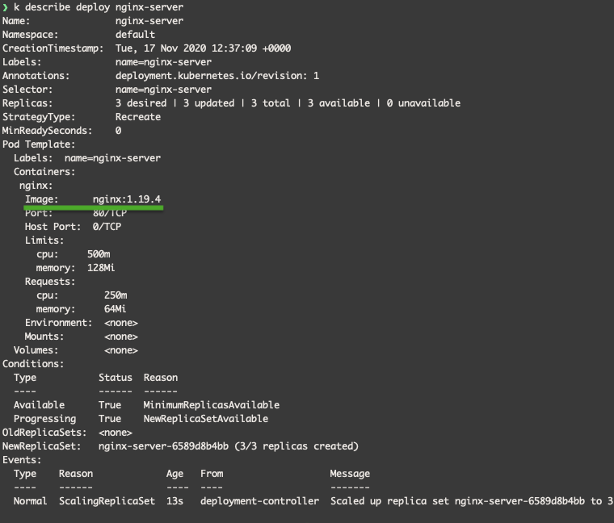
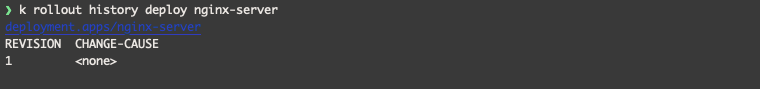
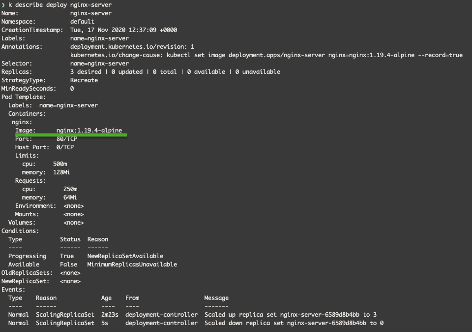
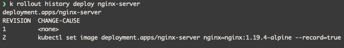
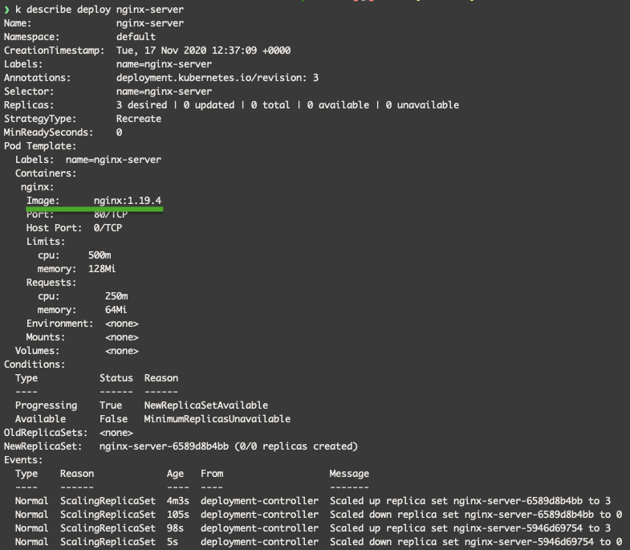
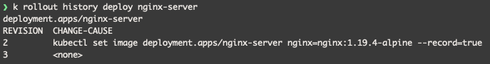

Primero se crea el deployment:
```shell script
kubectl apply -f deployment.yaml
```
Vemos que tiene la version `nginx:1.19.4`:



Y vemos el historial del rollout:


Luego actualizamos a la version `nginx:1.19.4-alpine`:
```shell script
kubectl set image deployment.apps/nginx-server nginx=nginx:1.19.4-alpine --record
```

Vemos que ahora tiene la version `nginx:1.19.4-alpine`:



Y vemos que en el historial del rollout hay un nuevo registro:



Por ultimo hacemos rollout undo hacia la version 1:

```shell script
kubectl rollout undo deployment.apps/nginx-server --to-revision=1
```

Vemos que ahora tiene otra vez la version `nginx:1.19.4`:



Y vemos que en el historial del rollout hay un nuevo registro:

